class: center

# Unbillable

## Exploiting Android In App Purchases

### Alfredo Ramirez

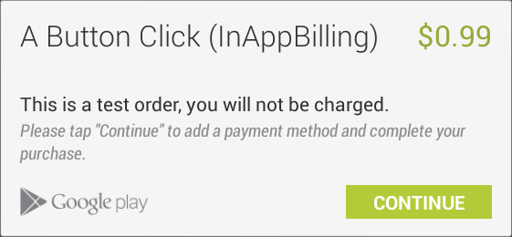

---

### I am a consultant and researcher at VSR in Boston.
<br />
<br />
<br />


.center[]

---

### I became interested in Android In-App Billing when I saw someone playing Candy Crush on the subway.

.center[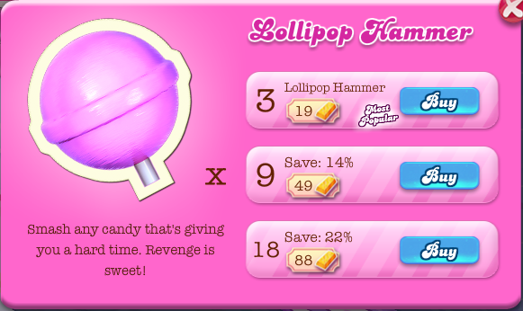]

???

As I watched this person play, I realized that the game only gave you a limited number of moves and that you had to buy more if you didn't finish the puzzle in your allotted moves. I thought this was absurd and wondered if I could find a way to get extra lives or lollipop hammers for free. As it turns out, I could.

Unfortunately, once you strip out the IAP from Candy Crush, it becomes a pretty mediocre match 3 game.

---
class:center, middle
# Why Talk About In-App Billing?

???

We start with discussing the motivation for this talk and why you should care about the topic.

---

### Mobile In-App Purchase revenue reached 2B USD in 2011 and should reach 14B this year.

.center[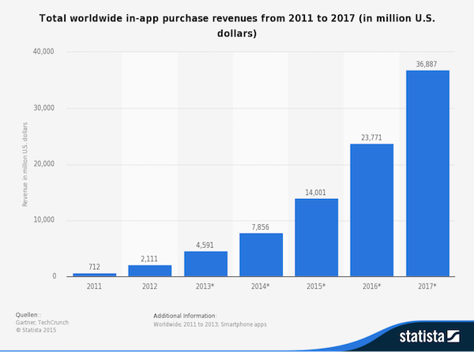]

???

Basically, IAP is a really big deal that makes a lot of money.

Sources: Gartner; TechCrunch

---

### Most top-grossing Android apps are games but there are exceptions like Pandora, Tinder and HBO Now.

.center[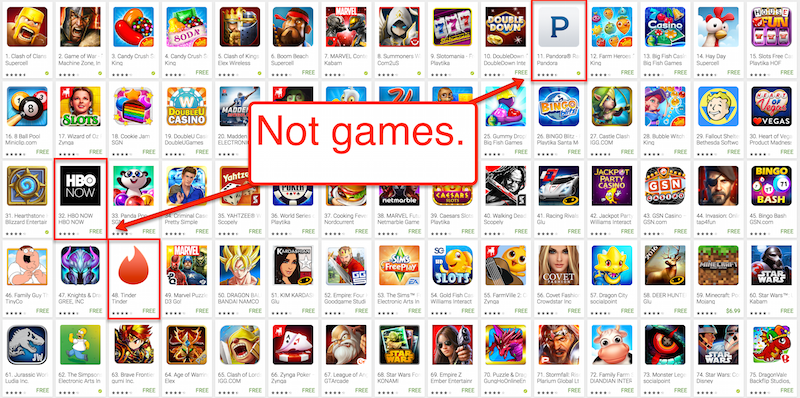]

???

As it turns out, people are more than happy to burn money on timewaster games like Clash of Clans and Candy Crush. Lots and lots of money.
---

### Games developers like Supercell saw revenue triple to 1.7B USD between 2013 and 2014.

.center[]

???

Clash of Clan's daily revenue is estimate at over 1 Million USD!
---

### Mobile MMORPGs are seeing gray markets appear similar to PC games like World of Warcraft.

.center[]

???

Accounts for popular Android and iOS MMORPG, Chaos & Order Online, sell for $100 USD a pop!

---

### This increasingly lucractive source of revenue is sure to attract more and more bad actors.

.center[]

---

class:center,middle

# Android In-App Billing Overview

---

### In-App Billing (IAB) allows users to purchase app content from within the app itself.

.center[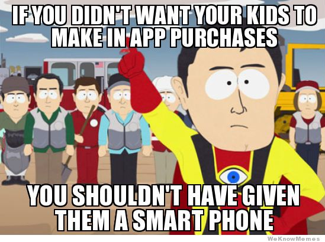]

---

### Google's IAB API allows developers to sell items without directly handling payment data.

.center[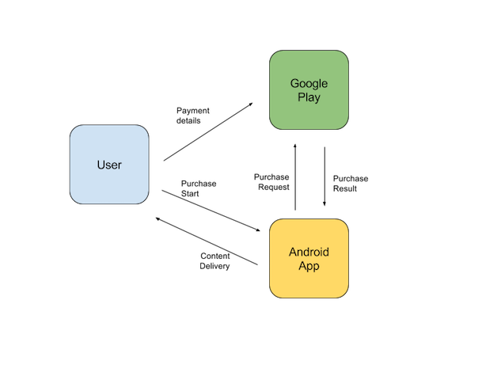]
---

### Google provides excellent documentation on the API, like this diagram.

.center[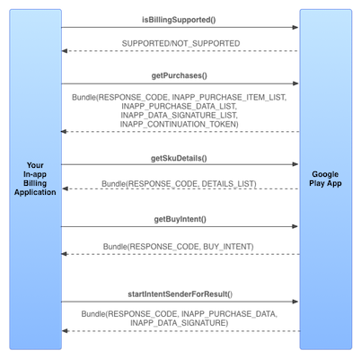]

---

### Actually, here is a slightly more accurate diagram.

.center[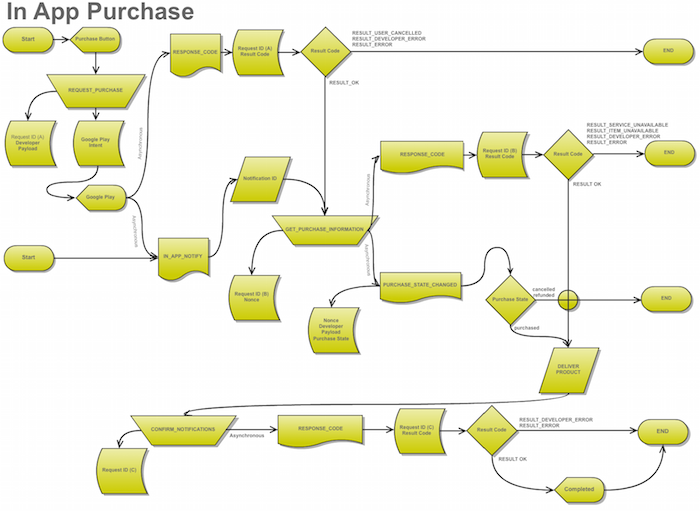]

---

### IAB relies on Intents to transfer purchase processing responsibilities to the Google Play Store.

.center[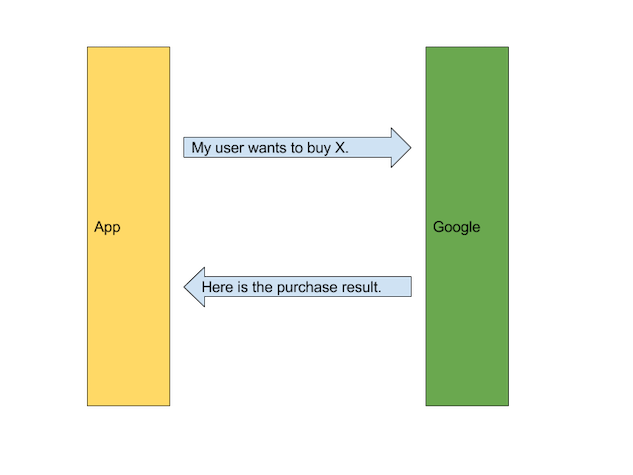]

---

### Implementing IAB is confusing so developers make mistakes that can be exploited to break their apps.

.center[]

---

### Google provides a simple application as a reference for developers to use for their own implementations.

.center[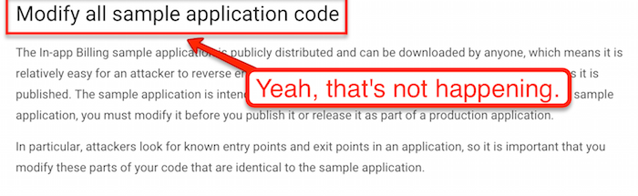]

---

### Google's demo application uses a mock class called IabHelper that implements the IAB API.

```java
package com.example.android.trivialdrivesample.util;

[...]

/**
 *
 * @author Bruno Oliveira (Google)
 *
 */
public class IabHelper {}
```

---

### IabHelper lacks many security features and is not suitable for production code.

.center[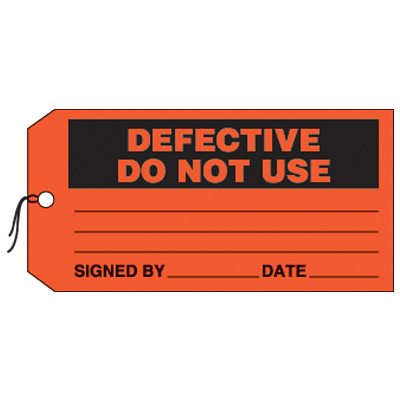]

---

### Needless to say, many of the top-grossing apps copy this class without modification.

```java
Candy Crush:

package com.king.store.billingutil;

class IabHelper$2$1

Marvel Battles:

package com.explodingbarrel.iap.util;

class IabHelper$2$1

```

---

### Unsurprisingly, cracked binaries exist for most top-grossing Android apps that bypass the IAB process.

.center[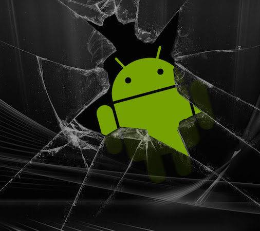]

---

### Hacked APKs cost developers in lost revenue and are a source of mobile malware.

.center[]

???

http://www.makeuseof.com/tag/cracked-android-apps-and-games-read-this-before-downloading/

---

class:center,middle

# Implementation and Exploitation Analysis

---

### We will be leveraging the Cydia Substrate framework in order to exploit application flaws.

.center[]

---

### Cydia Substrate is a framework for Android that allows you to modify an app's behavior at runtime.

.center[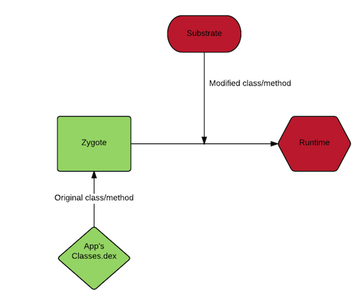]

---

### First, you hook into a target class when it is loaded.

```java
String classToHook = "<name of class to hook>";
  MS.hookClassLoad(classToHook, new MS.ClassLoadHook() {
    public void classLoaded(Class<?> hookedClass)
  });
```
---

### Then you can target a specific method and modify its behavior, replace parameters, etc.

```java
MS.hookMethod(hookedClass, hookedMethod,
  new MS.MethodAlteration() {
    public Object invoked(Object _this, Object... args)
      throws Throwable {
*       return invoke(_this, args);
    }
  });
```

---

### Our exploit example focuses on Candy Crush, which has long been a top-grossing Android application.

.center[]

---

### Candy Crush also commits many common IAB implementation errors that allow it to be broken.

.center[]

---

### There is no developer payload string to verify the authenticity of a purchase. Think CSRF.

```java
public void launchPurchaseFlow(Activity paramActivity,
String paramString, int paramInt,
IabHelper.OnIabPurchaseFinishedListener
paramOnIabPurchaseFinishedListener)
  {
    launchPurchaseFlow(paramActivity, paramString, paramInt,
*     paramOnIabPurchaseFinishedListener, "" <--- Missing token!);
  }
```
---

### The code includes lots of log statements that make troubleshooting exploits simple.

```java
Candy Crush:

*localObject3 = "Constructing buy intent for ";
          localObject1 = localObject1.append(localObject3);
          localObject1 = localObject1.append(paramString1);
          localObject3 = ", item type: ";
*logDebug(localObject1);

Pandora:

*localObject4 = localObject1.append("signature verification ");
if (bool3)
{
  localObject1 = "succeeded";
  localObject1 = localObject4.append(localObject1).
    append(" for request ID ");
* Logger.error((String)localObject3, (String)localObject1);
}
```
---

### Transaction signature verification for the transaction occurs on the client side instead of on the server.

```java
Candy Crush:

public static boolean verifyPurchase(String paramString1,
  String paramString2, String paramString3)

public static boolean verify(PublicKey paramPublicKey,
  String paramString1, String paramString2)

Pandora:

protected boolean verifySignature(String paramString1,
  String paramString2, String paramString3)
{ return Kiwi.isSignedByKiwi(paramString1 + "-" +
    paramString2, paramString3); }

Clash of Clans:

public static boolean b(String paramString1, String paramString2,
  String paramString3)
```
---

### Client-side signature verification is one of the most common implementation errors in Android apps.

.center[]

---
class:center,middle

# Demo

---

### Circumventing IAB in Candy Crush is a very simple three-step process.

.center[]

---

### The first thing we have to do is hook the IabHelper class.

```java
String classToHook = "com.king.core.billingutil.IabHelper";
        MS.hookClassLoad(classToHook, new MS.ClassLoadHook() {
            public void classLoaded(Class<?> hookedClass) {
                Logging.ClassLoaded(logTag, hookedClass);
```
---

### We then create fake response from "Google" so that a cancelled transaction appears successful.

```java
} else  if (hookedMethod.getName().equals("handleActivityResult")){
  Intent intent = new Intent();
* intent.putExtra("RESPONSE_CODE", 0);
  intent.putExtra("INAPP_DATA_SIGNATURE", "fake_sig");
  JSONObject purchase = new JSONObject();
  purchase.put("orderId", "12999763169054705758.1316213752962757");
  purchase.put("packageName", "com.king.candycrushsaga");
* purchase.put("productId", sku);
  purchase.put("purchaseTime", System.currentTimeMillis());
  purchase.put("purchaseState", 0);
  purchase.put("purchaseToken", "fake_token");
  intent.putExtra("INAPP_PURCHASE_DATA", purchase.toString());
  return invoke(_this, args[0], -1, intent);
```
---

### Finally, we hook the billing Security class so that all verification methods always return True.

```java
classToHook = "com.king.core.billingutil.Security";
MS.hookClassLoad(classToHook, new MS.ClassLoadHook() {
    public void classLoaded(Class<?> hookedClass) {
        Logging.ClassLoaded(logTag, hookedClass);
        Logging.LogClassDeclaredMethods(logTag, hookedClass);
        for (Method method : hookedClass.getDeclaredMethods()) {
*           if (method.getName().equals("verify")
*           || method.getName().equals("verifyPurchase")) {
                try {
                    final Method hookedMethod = method;
                    MS.hookMethod(hookedClass, hookedMethod,
                    new MS.MethodAlteration() {
                        public Object invoked(Object _this,
                        Object... args)
                        throws Throwable {
*                           return true;
                        }
                    });
```

---

class:middle,center

# Demo Again

---
class:middle,center

# IAB Implementation Best Practices

.center[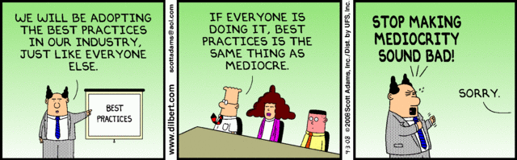]

---

### Ultimately, too much client-side trust is the downfall of most Android apps that implement IAB.

.center[]

---

### A developer server should handle sensitive tasks like signature verification and content delivery.

.center[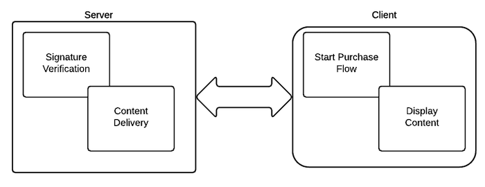]

---

### It will often make sense to keep track of content or game variables on a dev server, not the client.

.center[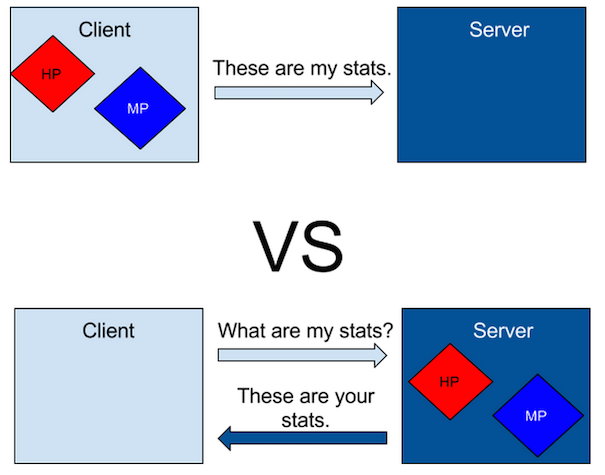]

---

### Mobile gaming can learn a lot from PC MMORPGs when it comes to client-side trust.

.center[]

---

### Use tokens to verify transaction authenticity, much like CSRF in web apps.

.center[]

---

### Obfuscation will not stop a determined attacker but it may convince them to crack a different app instead.

.center[]

---

### Protect your public key so that it cannot be easily replaced by an attacker-controlled key.

.center[]

---

### In general, don't use unmodified sample code downloaded from the Internet.

.center[]

---

### Vulnerabilities like Heartbleed have taught us that even established libraries can be dangerous.

.center[]

---

### Sample code or random code from Github or SO is riskier than OpenSSL or Bash.

.center[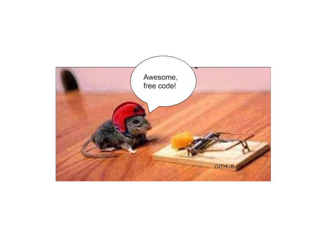]

---

### As security professionals, we can helps devs properly implement Android IAB in their apps.
<br />
.center[***Questions?***]
<br />
.center[]
<br />
Alfredo Ramirez <aramirez@vsecurity.com><br/>
@bonds0097<br/>
www.github.com/bonds0097